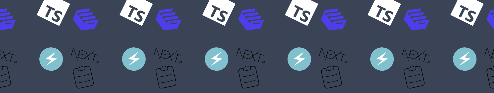

    

## Overview

This repository can give you a head start in creating your application with an as **low-code** experience as possible.

- An authentication and user management system using [Clerk](https://clerk.dev).
- A main data store with [Airtable](https://airtable.com/).
- A server-side RESTful API with authentication.

### More Technical Capabilities

- Fully customizable and themable interfaces using [Chakra-UI](https://chakra-ui.com/).
- SSR capabilities using [Next.js](https://nextjs.org/) as the base framework.
- [TypeScript](https://typescriptlang.org) as the language of choice.
- Typed resource forms with [react hook form](https://react-hook-form.com/).
